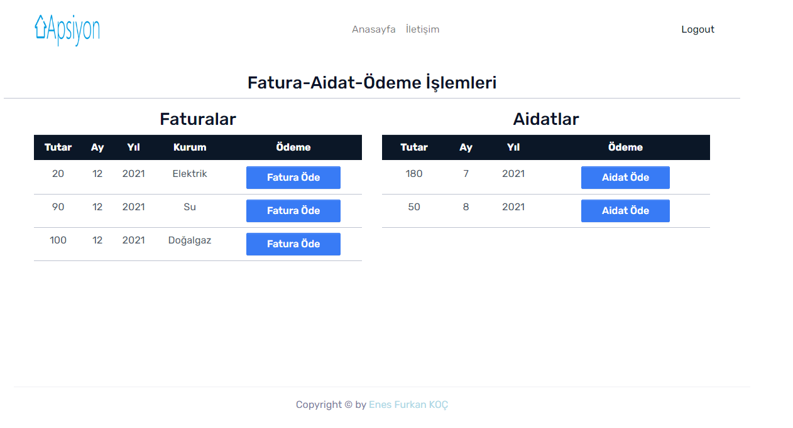

# 
 Bootcamp Bitirme Projesi - Apartman Yönetim Sistemi

## Kullanılan Teknolojiler
- C#
- ASP .NET CORE 
- ASP .NET CORE MVC
- MSSQL
- MONGO DB
- Rest API
- Entity FrameWork Core

## Kullanıcı İşlemleri 
- Apartman sakinleri her daireye özel üyelikler ile sisteme giriş yapabilir.
- Güncel Fatura borçlarını görebilir ve ödeyebilirler.
- Güncel Aidat borçlarını görebilir ve ödeyebilirler.
- Yöneticiye Mesaj gönderebilirler

### Kullanıcı Sayfaları
- Anasayfa

- Kredi Kartı Ödeme Sayfası

- İletişim Sayfası

